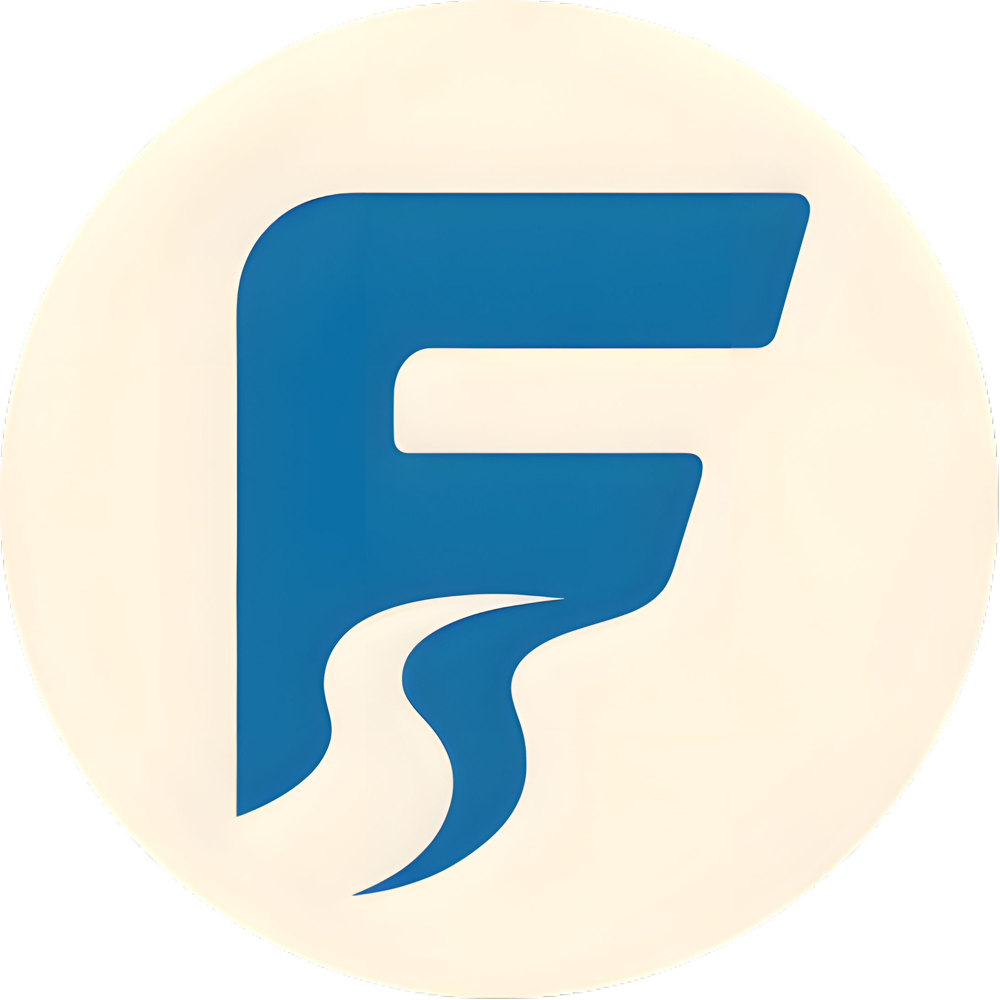

# Flath – Manage Your Time, Master Your Journey

  

Duc & Khai's Journey to Create a Fantastic, Wonderful, Significant, Magnificent, Outstanding, Class of Titans and World Class Project to manage time and grow ourselves

## Day 1 - Oct 5, 2025

*"A journey of a thousand miles begins with a single step"* - Confucius.

One day, Khai saw a self-help video on TikTok about how to improve programming skills and sent it to Duc.  
"Can we do a project to help people?" – Khai asked. 🧐
"JUST DO ITTTT!" – Duc agreed =))😃.  

The idea was forgotten for a week, but on Oct 5, 2025, at KimWon Teahouse, 26 Bac Ai Street, Binh Tho Ward, District 9, Ho Chi Minh City, Vietnam, we remembered it and decided to start this project. We began with just a small idea, "small" skills, and "small" knowledge. But we believe that **over time this will grow bigger**, and so will our skills and knowledge.  

We are both students at PTIT-HCM. We feel that many students suffer from stress because they cannot organize their time to study, work, and live. So we discussed how to help them relieve stress, and after 30 minutes, this repo was created 🤣. 

## Day 2 - Oct 6, 2025 

*“Sometimes the flow slows down - only to gather strength.”* - Anonymous. 

After the first spark of excitement, we realized that even a flowing river needs a clear direction before it can reach the sea. So today, we decided to slow down for a while - not to stop, but to understand. 

We took a step back to learn, reflect, and plan.

Flath isn’t just another “to-do app” - it’s a way to explore how time, habits, and focus interact with human growth. To make it meaningful, we need to know what we’re building, why we’re building it, and how we’ll walk this path together. 

We decided to spend this phase understanding more about:
  1. How to use GitHub effectively for teamwork - managing branches, commits, and collaboration.
  2. How to apply what we’ve learned from the university course “System Analysis and Design.”
  3. How to plan our weekly workflow - we’ll take turns leading; this week one plans, next week the other.

We’ll keep moving forward - step by step, even if the steps are small. What matters is that we continue to walk the path, learn from each phase, and stay true to the spirit of Flath.

We hope that everything goes smoothly, and that we’ll keep finding our rhythm - in work, in learning, and in life.

## Day 3 - Oct 14, 2025

*"Your mind has to be stronger than your feeling. YOUR MIND HAS TO BE STRONGER THAN YOUR FEELING"* - Someone.

This sentence doesn’t really relate to today’s topic.
Yesterday, we used Jira for task management and planned for the next two days.
Today, our task was simply to set up the project. We decided to use Next.js for the frontend, but we haven’t yet decided what to use for the backend.

The reason why we chose Next.js is quite simple — we wanted to learn a new framework. We’ve already used React before, so we wanted to explore and learn Next.js this time. In addition, ChatGPT recommended this framework to us, so we had even more reason to choose it.

Tomorrow, we’ll start coding the first UI page. Let’s see if we can finish it within the deadline!
